# datashader-demos

Twelve production-shaped transparent PNG renderers for data that is too large to draw mark-by-mark, covering points, trajectories, categories, iterative basins, events, uncertainty, networks, terrain, routes, and rare observations.

```bash
uv sync --group dev
uv run datashader-demos render
uv run datashader-demos validate
uv run pytest
```

The primary artifacts are `out/*-transparent.png`. Each has a manifest with row count, render time, dimensions, and alpha/content pixel statistics. All datasets are deterministic synthetic fixtures.

## Transparent PNG reference gallery

`catalog.json` makes the twelve scenarios searchable by use case, question, family, complexity, and tags.

| Point density | Trajectories | Category mix | Phase portrait |
|---|---|---|---|
| 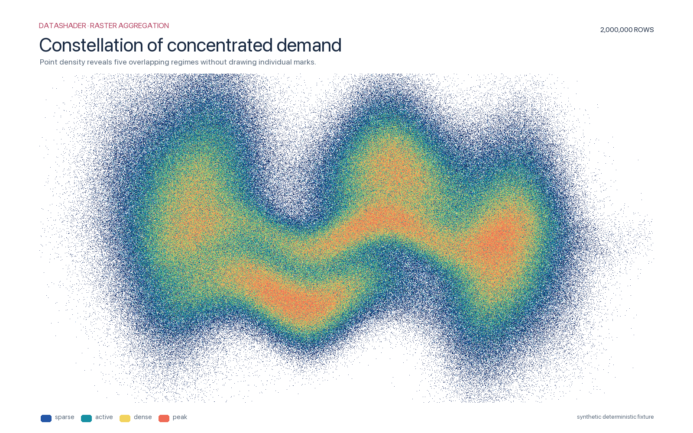 | 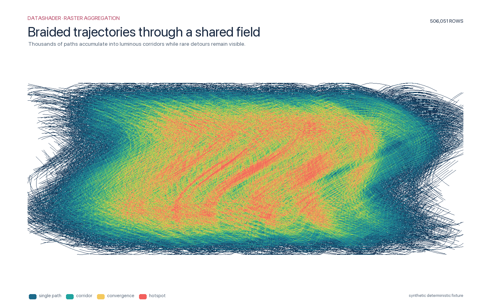 | 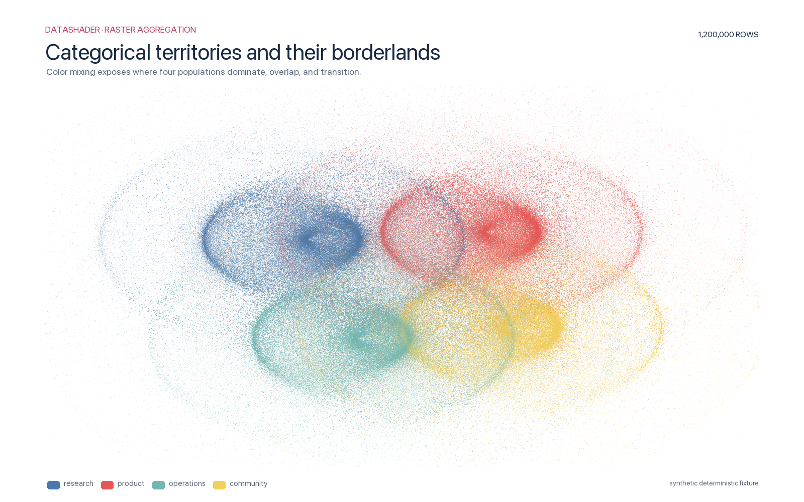 | 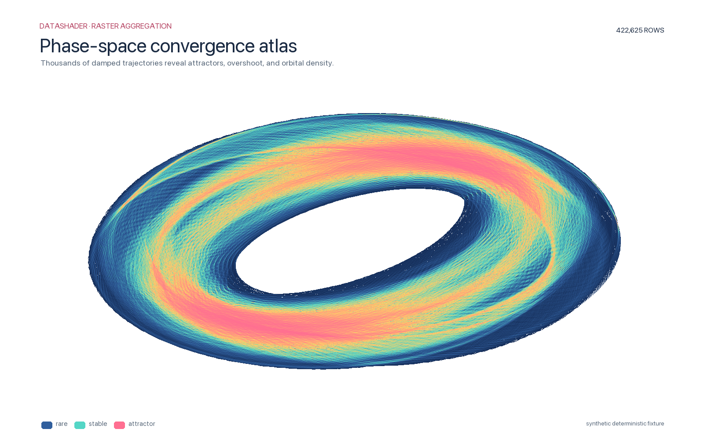 |
| Fractal basin | Parameter sweep | Event raster | Uncertainty fan |
| 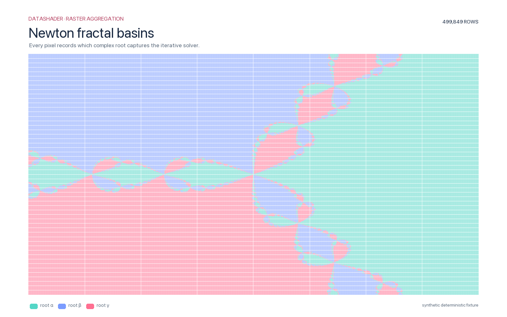 | 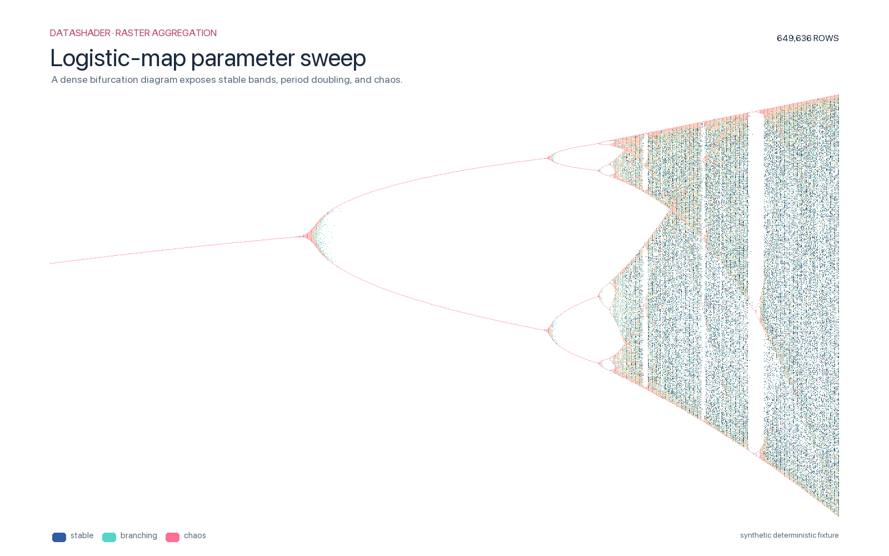 | 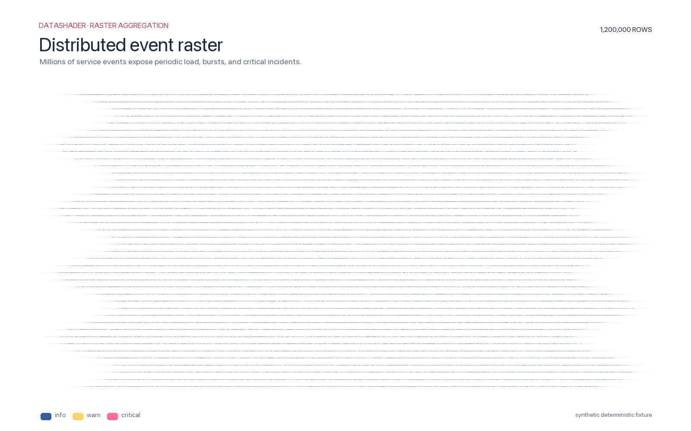 | 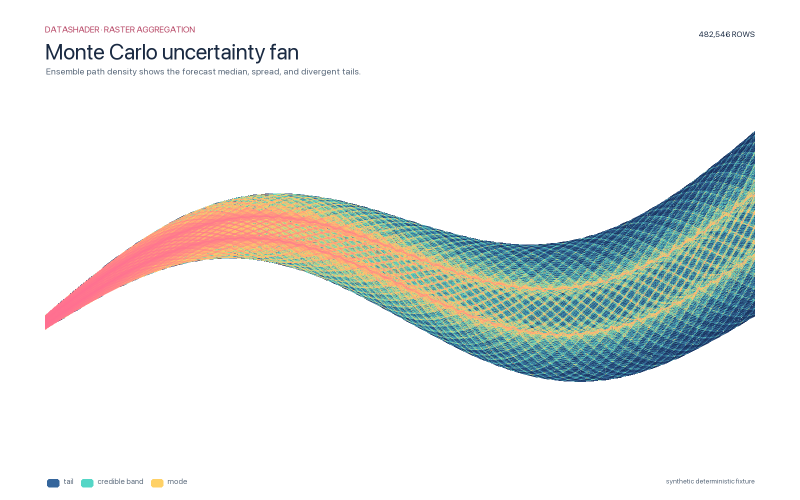 |
| Network density | Terrain scan | Geo routes | Rare outliers |
| 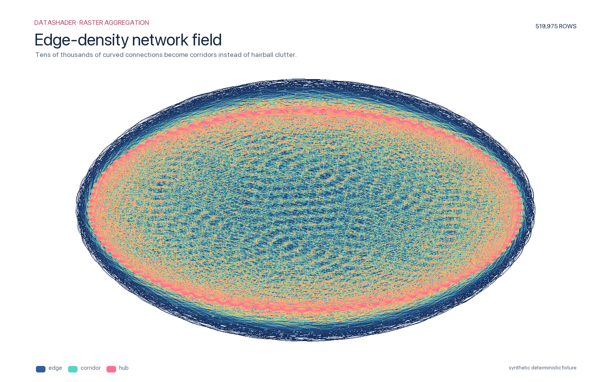 | 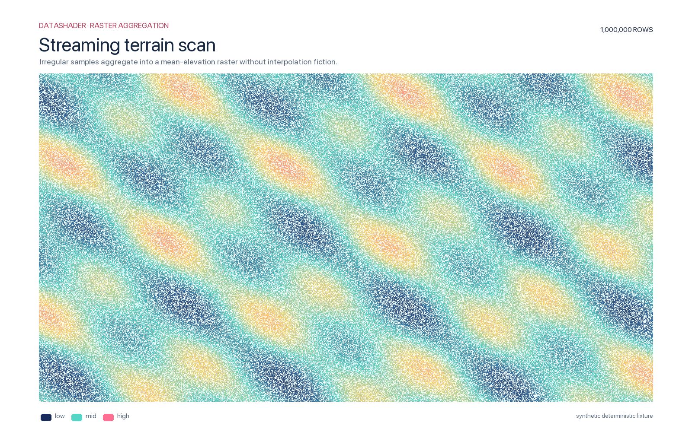 | 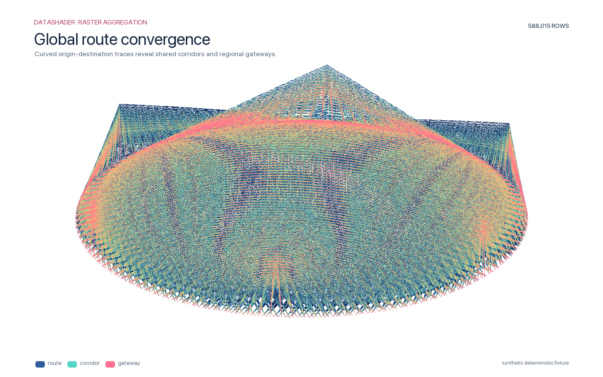 | 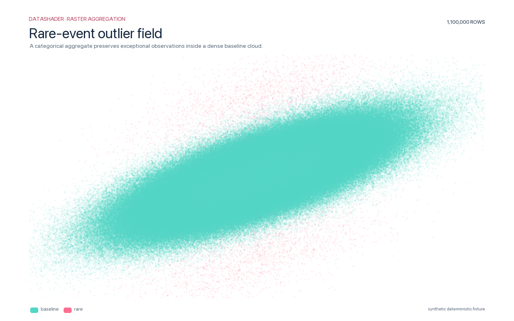 |
